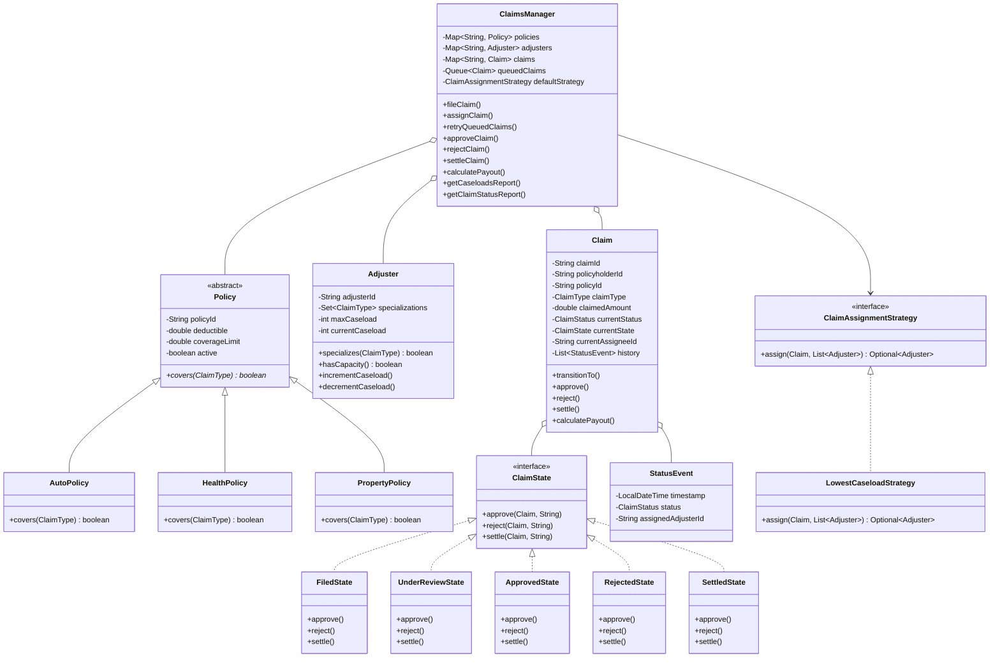

# ShieldSecure Claims Intake & Adjuster Assignment System

A robust, object-oriented Low-Level Design (LLD) prototype in Java for automated insurance claim intake, policy validation, adjuster strategy assignment, state machine lifecycle management, and financial payout calculation.

---

## How to Build & Run

### Prerequisites
- Java Development Kit (JDK 17 or higher)

### Build Command
Compile all Java source files from `src/` into the `bin/` directory:

```bash
javac -d bin src/*.java
```

### Run Command
Launch the interactive command-line interface driver:

```bash
java -cp bin Main
```

*(Or specify explicit JDK path on Windows PowerShell:)*
```powershell
& "C:\Program Files\Microsoft\jdk-17.0.20.101-hotspot\bin\javac.exe" -d bin src/*.java
& "C:\Program Files\Microsoft\jdk-17.0.20.101-hotspot\bin\java.exe" -cp bin Main
```

---

## Design Overview

### Core Class Structure
- **Policy (abstract base class)**: Encapsulates policy attributes (`policyId`, `deductible`, `coverageLimit`, `active`). Subclasses (`AutoPolicy`, `HealthPolicy`, `PropertyPolicy`) enforce claim type coverage.
- **Adjuster**: Manages adjuster ID, specializations (`Set<ClaimType>`), `maxCaseload`, and `currentCaseload`.
- **Claim (Aggregate Root)**: Tracks claim details, active status, assigned adjuster, status event history trail, and delegates lifecycle behavior to its current `ClaimState`.
- **StatusEvent**: Immutable audit log event tracking timestamp, claim status, and assigned adjuster ID.
- **ClaimsManager (Central Orchestrator)**: Manages in-memory data repositories (`policies`, `adjusters`, `claims`, and `queuedClaims`), enforces validation order during claim filing, delegates assignment to `ClaimAssignmentStrategy`, and orchestrates lifecycle operations.

---

## Design Patterns Used

### 1. Strategy Pattern (`ClaimAssignmentStrategy`)
- **Motivation**: Allows flexible, pluggable adjuster assignment algorithms without modifying core `ClaimsManager` business logic.
- **Implementation**:
  - `ClaimAssignmentStrategy` (interface): Defines `Optional<Adjuster> assign(Claim claim, List<Adjuster> eligible)`.
  - `LowestCaseloadStrategy` (concrete strategy): Filters candidate adjusters by claim type specialization and available capacity (`currentCaseload < maxCaseload`). Selects the adjuster with the lowest current caseload (tie-breaker: lowest `adjusterId` lexicographically).

### 2. State Pattern (`ClaimState` + Concrete States)
- **Motivation**: Enforces legal state machine transitions and authorization logic strictly within dedicated state objects, eliminating monolithic `if`/`switch` chains in `Claim`.
- **Implementation**:
  - `ClaimState` (interface): Defines `approve()`, `reject()`, `settle()`.
  - `FiledState`: Initial state when a claim is filed. Rejects illegal approval/rejection/settlement.
  - `UnderReviewState`: Active review state. Enforces adjuster authorization (`currentAssigneeId` matching). Permits transition to `ApprovedState` or `RejectedState`.
  - `ApprovedState`: Approved state. Permits authorized settlement to `SettledState`.
  - `RejectedState`: Terminal state. Rejects further status changes.
  - `SettledState`: Terminal state. Rejects further status changes.

---

## Business Rule Assumptions & Edge Cases

### Deductible Edge Case (Option B Chosen)
- **Rule**: What happens when `claimedAmount < deductible`?
- **Decision (Option B)**: The claim is rejected immediately during filing with a descriptive message:
  `Error: Claimed amount ($100.00) is less than policy deductible ($500.00). Claim rejected.`
- **Rationale**: Prevents non-viable claims from consuming adjuster caseload slots or creating invalid $0 approval workflows.

### Policy Coverage Validation
- **Rule**: `AutoPolicy` covers `AUTO` claims, `HealthPolicy` covers `HEALTH` claims, and `PropertyPolicy` covers `PROPERTY` claims. Cross-type filing returns a validation error (`Error: Policy POL001 does not cover HEALTH claims.`).

### Adjuster Tie-Breaking
- **Rule**: When multiple eligible adjusters specializing in the claim type have the exact same lowest caseload, ties are broken deterministically by the lowest `adjusterId` in lexicographical order (e.g., `ADJ001` before `ADJ003`).

### Capacity Release & Queued Claim Auto-Retry
- **Rule**: Adjuster caseload capacity is decremented when an assigned claim reaches `REJECTED` or `SETTLED`.
- **Trigger**: Upon capacity release, `ClaimsManager` automatically executes `retryQueuedClaims()`, re-evaluating queued claims in FIFO order and assigning them to newly available capacity.

### Adjuster Authorization
- **Rule**: Only the currently assigned adjuster (`currentAssigneeId`) can approve/reject a claim in `UNDER_REVIEW` or settle an `APPROVED` claim. Unauthorized attempts return an explicit security error:
  `Error: Unauthorized: Only the assigned adjuster (ADJ001) can modify this claim.`

---

## File Structure

```
/src
  Main.java                     # CLI Interactive Driver & Menu Loop
  ClaimType.java                # Enum: AUTO, HEALTH, PROPERTY
  ClaimStatus.java              # Enum: FILED, UNDER_REVIEW, APPROVED, REJECTED, SETTLED
  Policy.java                   # Abstract Base Class for Policies
  AutoPolicy.java               # Subclass for Auto Coverage
  HealthPolicy.java             # Subclass for Health Coverage
  PropertyPolicy.java           # Subclass for Property Coverage
  Adjuster.java                 # Adjuster Entity & Caseload Tracker
  StatusEvent.java              # Audit History Event Model
  ClaimState.java               # State Pattern Interface
  FiledState.java               # Concrete State: FILED
  UnderReviewState.java         # Concrete State: UNDER_REVIEW
  ApprovedState.java            # Concrete State: APPROVED
  RejectedState.java            # Concrete State: REJECTED
  SettledState.java             # Concrete State: SETTLED
  Claim.java                    # Aggregate Root Domain Entity
  ClaimAssignmentStrategy.java  # Strategy Pattern Interface
  LowestCaseloadStrategy.java   # Strategy Implementation
  ClaimsManager.java            # Central Orchestrator & Repository Manager
```

---

## Class Architecture Diagram



---

## Edge Case Test Suite

All 6 core business edge cases have been verified:
- [x] **Filing against inactive policy**: Properly rejected with clear error message.
- [x] **Claimed amount below deductible (Option B)**: Immediately rejected at filing time.
- [x] **No eligible adjuster capacity**: Claim queued (`FILED`), automatically retried and assigned when capacity opens up.
- [x] **Invalid state transitions**: Illegal actions (e.g. double approval or settling `UNDER_REVIEW`) blocked with clear error message.
- [x] **Post-deductible payout exceeds limit**: Payout capped cleanly at policy coverage limit.
- [x] **Unauthorized adjuster action**: Operations by unassigned adjusters rejected with explicit authorization message.

---

## Known Limitations & Future Enhancements

- **Persistence**: Prototype stores state in-memory; future iterations can integrate a relational database (e.g., PostgreSQL/H2 via JPA/Hibernate).
- **Concurrency**: Thread-safety can be expanded with `ConcurrentHashMap` and lock-free atomic counters for distributed workloads.
- **REST API**: Future releases can expose RESTful Web APIs using Spring Boot or Lightweight HTTP Handlers.
